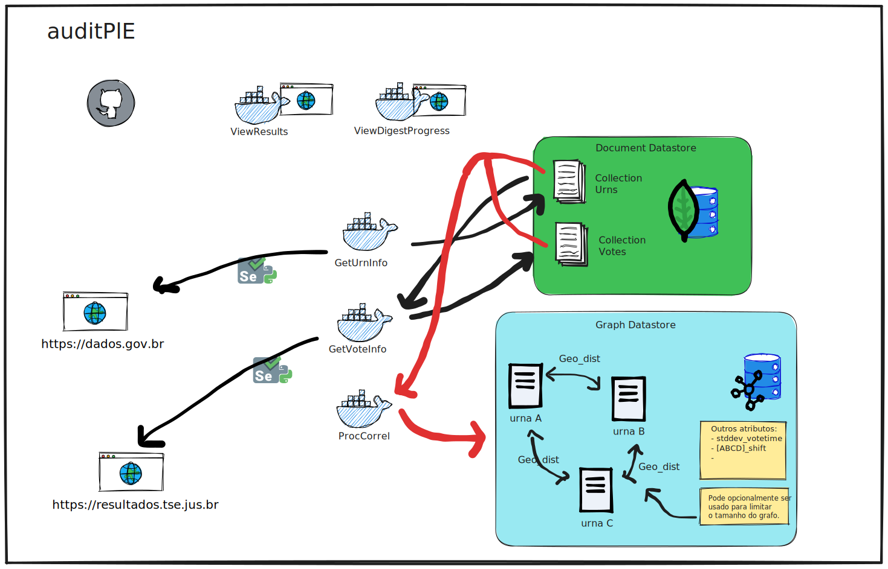

# auditUrnas

Projeto de Auditoria de dados publicos do TSE, buscando esclarecer dúvidas e/ou mitigar desinformacoes relacionadas a fraudes no processo eleitoral.

# Arquitetura do projeto



## Tecnologias utilizadas:
- Python
- Selenium (web scrapping)
- Docker
- MongoDB (persistência de documentos)
- Neo4J (persistência de grafos)


---
# Objetivos:

 1 - Obter lista de zonas, seções e nr local votação (mubu - municipio??) por estado;

 2 - Iterar em todas as urls compostas pelas zonas e seções para baixar cada um dos logs de urna
     Exemplo de link composto de zona e seção 
     https://resultados.tse.jus.br/oficial/app/index.html#/eleicao;e=e545;uf=ac;ufbu=ac;mubu=01120;zn=0008;se=0072/dados-de-urna/log-da-urna


 3 - Processar todos os logs extraindo informações relevantes. Enviar problemas de processamento para um arquivo de log a parte. Carregar dados processados como documentos em um mongodb;

 4 - Iterar no documento, criando um campo de duração de votação (ordena os resultados por urna e timestamp, e adiciona um campo duração considerando o timestamp do anterior - timestamp do atual)

 5 - Com a base carregada e funcional, processar os seguintes dados:
    - Reportar votos com duração de operação inferior a meio minuto.
    - Reportar top 100 votos mais rápidos do Brasil.
    - gráfico de dispersão de votos no tempo (eixo X) considerando estado, região, municipio (eixo y).
    - mesmo anterior, filtrando modelo da urna (Avaliar como descobrir se é modelo novo ou não)
    - Como avaliar discrepancias fortes entre filtros regionais de maneira autonoma?

---
# To-do
 - [] Obter de maneira programática a relação de todas sessões eleitorais
 - [] Desenvolver scrapper para obter os CSVs com detalhes
 - [] Conteinerizar log_getter.py (Inspecionar isolamento de codigo)
 - [] Iniciar escrita do log_processor.py para alimentar a collection vote_metrics 
 - [] Conteinerizar log_processor
 - [] Conteinerizar proc_correlation


# How-to
```
$ git clone git@github.com:jbernardes0/auditUrnas.git && cd auditBU
$ docker compose up -d
```


---


# Old stuff

## Como utilizar:
 - 0 - Some preps
  
```
$ git clone git@github.com:jbernardes0/auditUrnas.git && cd auditBU
$ mkdir -p database/boletins/
$ mkdir -p database/urnas
$ mkdir -p database/data
```

 - 1 - Faca o deploy do dockerfile da instancia mongodb. 
 - 2 - "Dah o curl" aí no site do TSE pra pegar os boletins consolidados por estado, pra ter a lista completa das urnas. 
     https://dados.gov.br/dataset/resultados-2022-boletim-de-urna
 - 3 - Instale as dependencias do requirements:
 ```
$ pip install -r requirements.txt
 ```
 - 4 - Roda o python 'consolida_ze.py' pra criar a collection 'zonas_eleitorais' contendo as informacoes de todas as urnas. 
 - 5 - Roda o python 'log_getter.py' pra fazer web scrapping no TSE e baixar os zips contendo os logs de cada uma das urnas (nao precisa aguardar o termino). 
 - 6 - Roda o python 'log_digestor.py' pra descoprimir os logs, processar, dar os put na collection 'resultados_de_urna', e deletar os zips+logs. 
 - 7 - Roda o python 'log_reporter.py' pra reportar com pandas e matplotlib algumas metricas legais. 


### Instancia mongodb deployada para armazenamento dos dados:
```
 $ docker build -t boletim-db:0.0.1 -f Dockerfile.db . 

 $ export DATADIR=/home/jobernardes/Documents/Projects/auditBU/database/data

 $ docker run \
 --name boletim-db1 \
 --network=auditbu-subnet-1 --ip 172.118.0.10 \
 -p 27017:27017 \
 -v $DATADIR:/data/db \
 -d boletim-db:0.0.1
 ```

 Obs.: Alterar DATADIR para um local apropriado para manter o datadir do container mongoDB


### Instancia webdriver/selenium deployada para coordenar download de boletins (desconsidera pfv):
```
 $ mkdir /database && ln -s ln -s /home/jobernardes/Documents/Projects/auditBU/database/boletins/ /database/boletins
 $ docker build -t boletim-getter:0.0.1 -f Dockerfile.bgetter .
 $ docker run \
 --name boletim-getter1 \
 --network=auditbu-subnet-1 --ip 172.118.0.11 \
 -v /database/boletins:/database/boletins/ \
 -d boletim-getter:0.0.1

 docker run -d --network=docker-subnet-1 --ip 172.118.0.21 -p 8080:8080 --name app-tomcat-hiflex-1 app-tomcat-hiflex:0.0.11
 ```

 Obs.: Alterar DATADIR para um local apropriado para manter o datadir do container mongoDB


